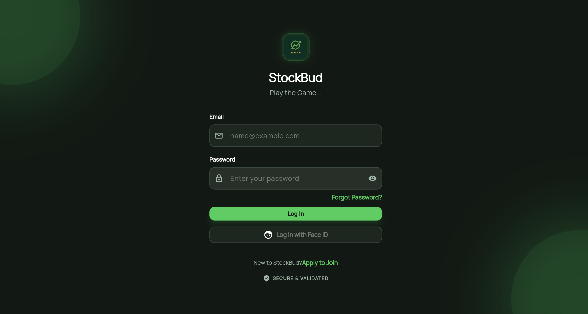
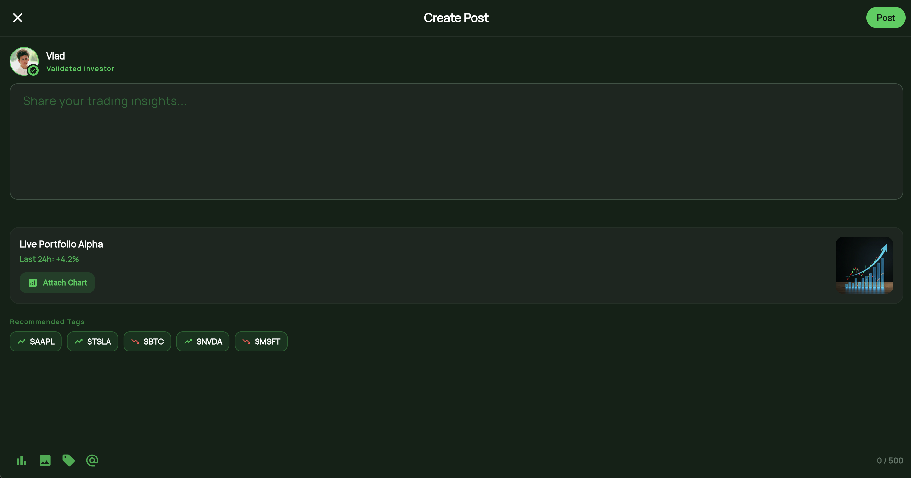
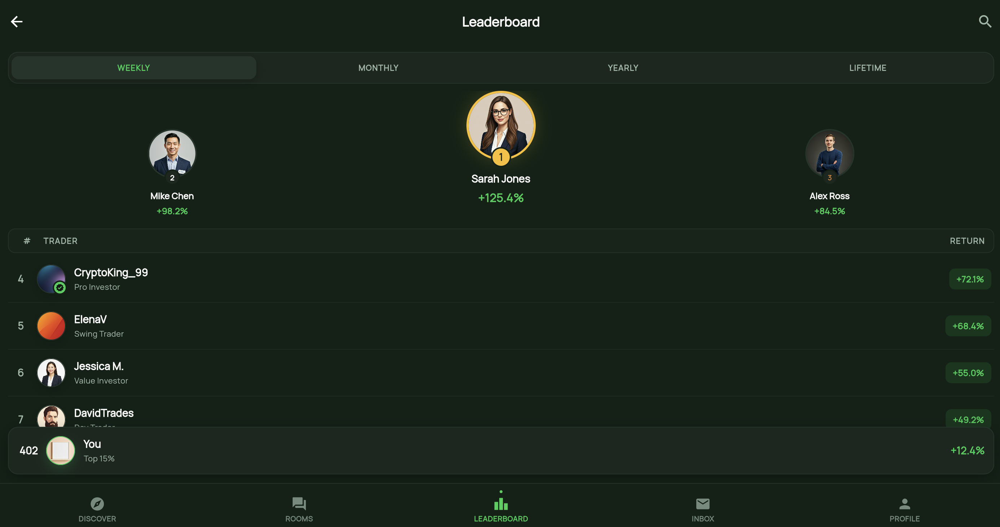
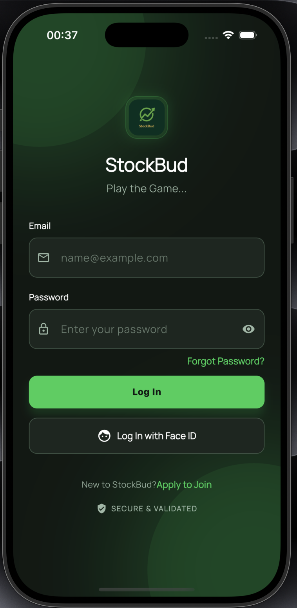
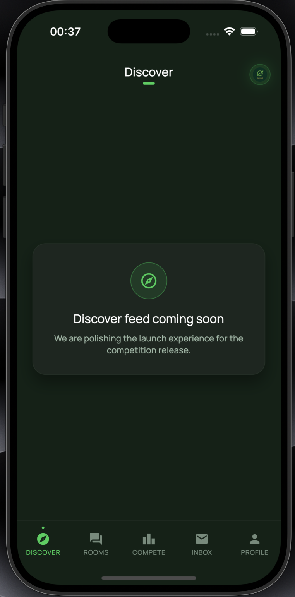
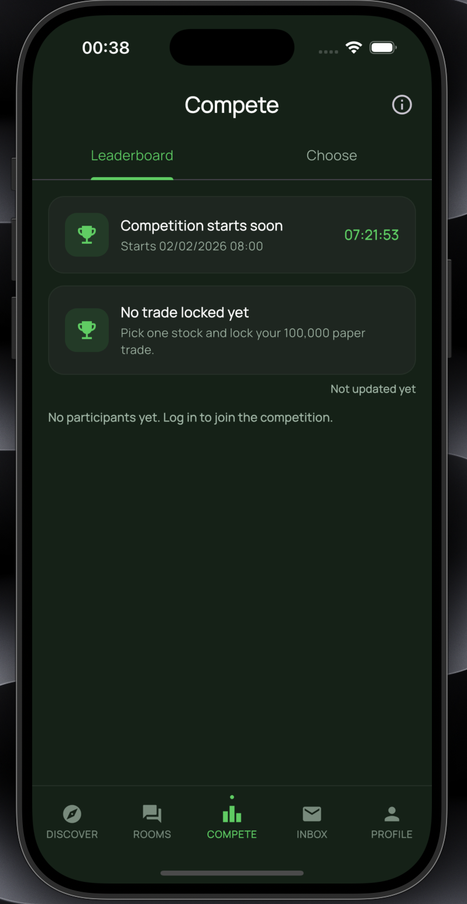
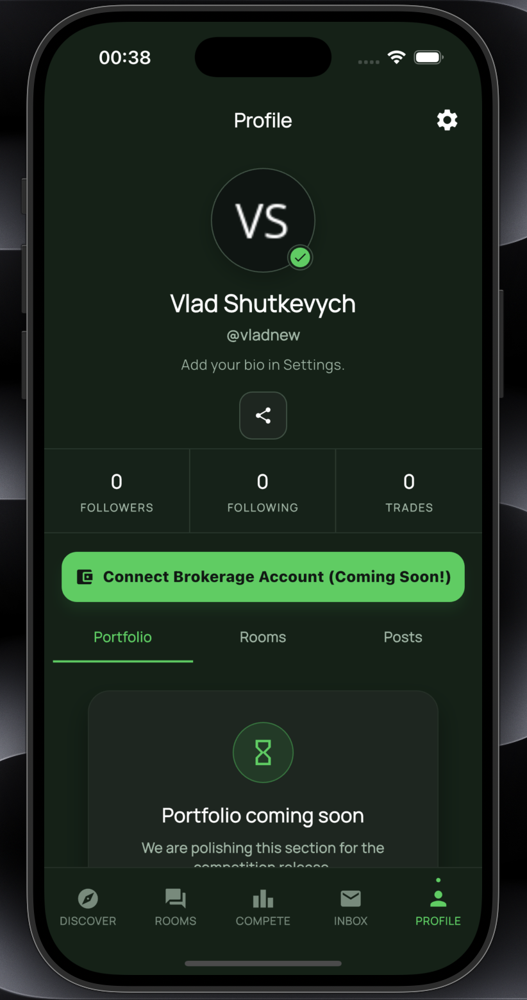
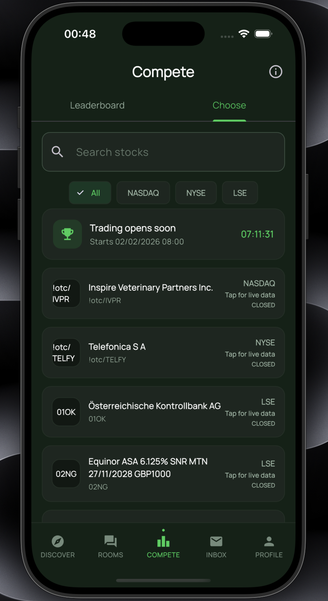

# StockBud

StockBud is a social portfolio-tracking platform designed to transform passive screen time into active financial participation. It bridges the gap between social media and wealth management by integrating real-time portfolio analytics with ticker-centric communities and competitive performance leagues.

The platform allows users to import brokerage data, analyze performance with institutional depth, and engage in high-signal market discussions. Architected for privacy and low latency, StockBud ensures financial data remains secure while providing a fluid, reactive social experience for retail investors.


## 💎 Core Features

### 📊 Portfolio Analytics
- **Brokerage Ingestion:** High-accuracy parsing for Trading 212 history and dividends.
- **Dynamic Valuation:** Live quotes and FX conversions across major currencies (GBP, USD, EUR).
- **Performance Tracking:** Comprehensive metrics including Market Value, Cost Basis, and PnL over custom timeframes.

### 🏆 Competitive Leagues
- **Performance Benchmarking:** Join private or public leagues to compete based on percentage returns (Return %), ensuring a level playing field regardless of capital size.
- **Dynamic Leaderboards:** Real-time ranking with movement deltas and pinned user stats.
- **Rules Engine:** Configurable parameters for capital allocation, sector limitations, and entry locks.

### 🤝 Social Ecosystem
- **Personalized Feed:** Discovery engine surfacing content based on owned assets and user interests.
- **Ticker Rooms:** Dedicated spaces for every stock featuring live charts, news, and threaded discussions using $CASHTAG indexing.
- **Real-Time Messaging:** Secure group chats and DMs with inline market snapshots and AI-driven thread summaries.

### 🔒 Privacy & Compliance
- **Local-First Security:** Sensitive data protected via biometric gates and granular Row-Level Security.
- **Automated Moderation:** Dual-layer profanity filtering and domain-verification for institutional competitions.
- **Compliance Standards:** Built-in disclaimers and account deletion flows to meet global data privacy requirements.

## 🏗️ System Architecture

```text
Flutter Client
→ Supabase Gateway (Auth & Realtime)
→ PostgreSQL (RLS-enforced Schema & Leaderboard Views)
→ Edge Functions (Twelve Data Proxy, Caching & Account Deletion)
→ Twelve Data API (Market Data & Time-Series)
```

- **Frontend:** Reactive architecture optimized for sub-100ms interaction latency and high-fidelity animations.
- **Data Resiliency:** Edge-cached time-series data ensures chart availability during upstream API outages.
- **Routing:** Integrated deep-link handling for seamless sharing of profiles and leagues across mobile platforms.

## 🛠️ Tech Stack

| Layer | Technologies |
|---|---|
| Frontend | Flutter, Dart, Google Fonts |
| Backend | Supabase, Postgres, Realtime, Storage |
| Infrastructure | Supabase Edge Functions, Deno, Docker |
| Database | PostgreSQL, PL/pgSQL, RLS |
| Market Data | Twelve Data API, Yahoo Finance Proxy |
| Mobile Hardware | Local Auth (Biometrics), Secure Storage, Share Plus |
| CI/CD & Tools | AGP, Kotlin, CocoaPods, Dotenv |

## 🧠 Engineering Excellence

### ⚡ Market Data Caching Strategy
To optimize API consumption and latency, the system implements a stale-while-revalidate caching layer within Edge Functions. Time-series data is snapshotted during active market hours, allowing the app to serve high-resolution charts from the local database when external rate limits are reached.

### 🛡️ Row-Level Security (RLS)
Security is architected at the database level. Strict RLS policies ensure that portfolio visibility is strictly opt-in and scoped to specific user IDs. Custom service-role logic manages sensitive operations like account deletion to maintain referential integrity while fulfilling GDPR requirements.

### 🔄 Real-Time Sync Engine
Leveraging Postgres Change Data Capture (CDC), the platform powers a "live" notification and leaderboard system. Data mutations are pushed directly to the Flutter client via WebSockets, eliminating the need for polling and reducing server overhead.

## 🌟 Project Impact
- ✅ **Scalable Infrastructure:** Managed via CLI and SQL migrations for reproducible, isolated environments.
- ✅ **Privacy-Centric Design:** Financial data is siloed and encrypted, prioritizing user anonymity.
- ✅ **Engagement-Driven Logic:** Replaces "doomscrolling" with financial literacy through gamified social loops.
- ✅ **Optimized UX:** High-performance cross-platform code ensuring consistent performance across iOS and Android.

## 🖼️ Project Gallery

### 🖥️ Desktop View

<p align="center">
  
</p>
<br/>
<p align="center">
  
</p>
<br/>
<p align="center">
  
</p>
<br/>
<p align="center">
  
</p>
<br/>
<p align="center">
  
</p>

### 📱 Phone View

<table>
  <tr>
    <td></td>
    <td></td>
    <td></td>
  </tr>
  <tr>
    <td></td>
    <td></td>
    <td></td>
  </tr>
</table>
